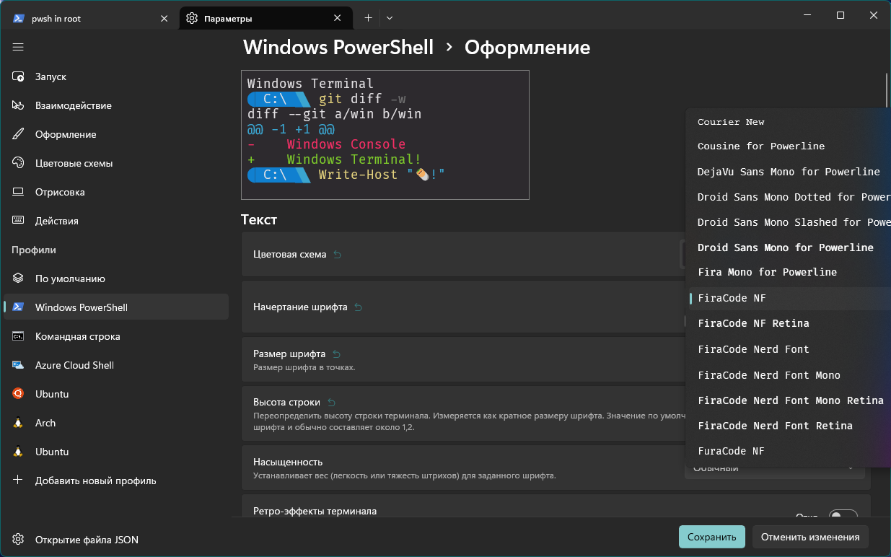
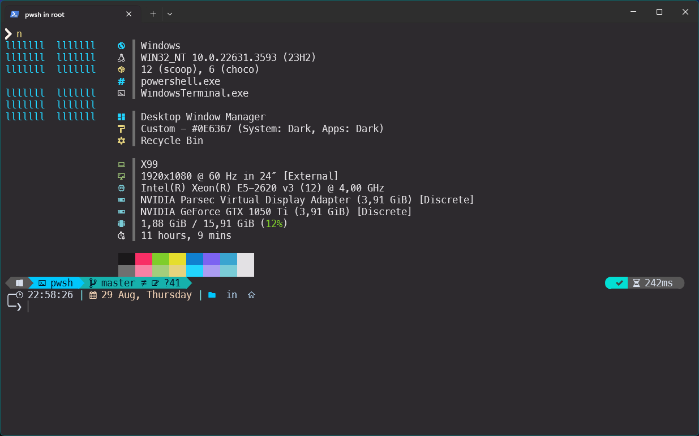
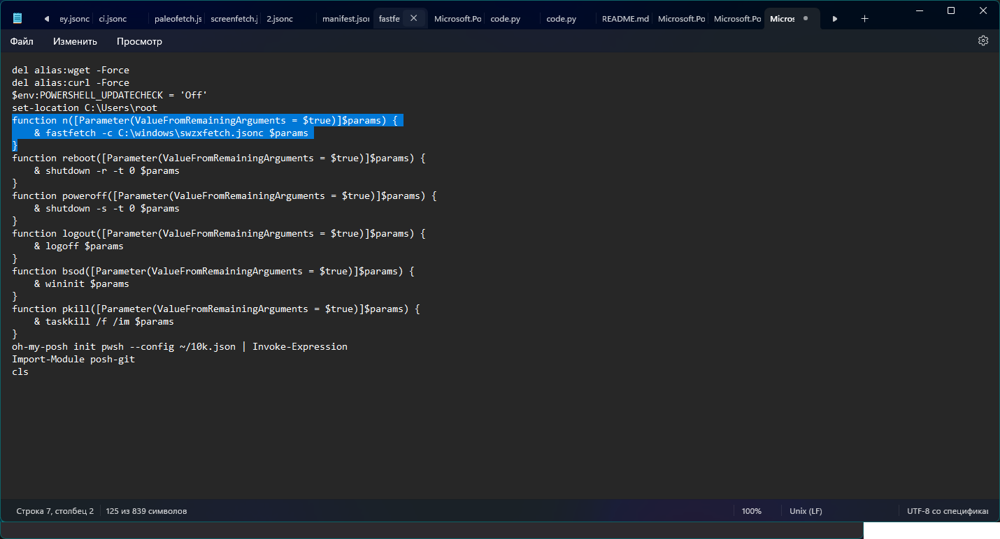

# Beginning
This manual will help you to install fastfetch to your Windows machine

# Installing
1. Install [scoop](https://scoop.sh/) on your machine\
2. Enter the `scoop install fastfetch` command\
3. Run `fastfetch`\
4. Fastfetch installed!

# Author's config
5. Download and install FiraCode fonts\
6. Set this font in terminal

7. Download the **swzxfetch.jsonc**, copy to C:\Windows\
8. Run Fastfetch with command `fastfetch -c C:\Windows\swzxfetch.jsonc`\
9. Profit!

# PowerShell Alias for Fastfetch
10. Enter this command `notepad $profile`
11. Put this - function n([Parameter(ValueFromRemainingArguments = $true)]$params) {\
& fastfetch -c C:\Windows\swzxfetch.jsonc $params into the notepad and save!

