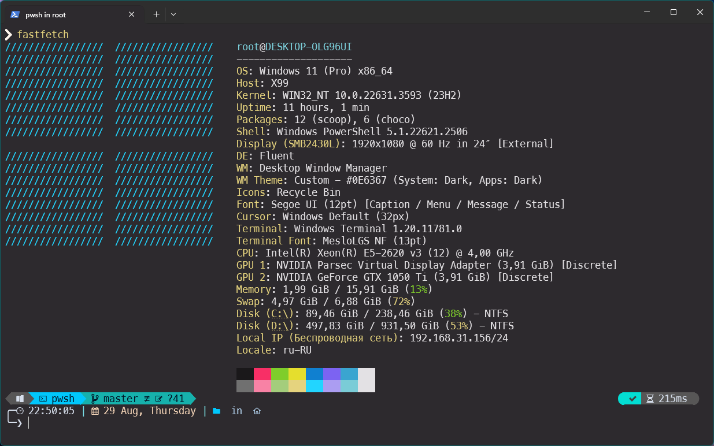
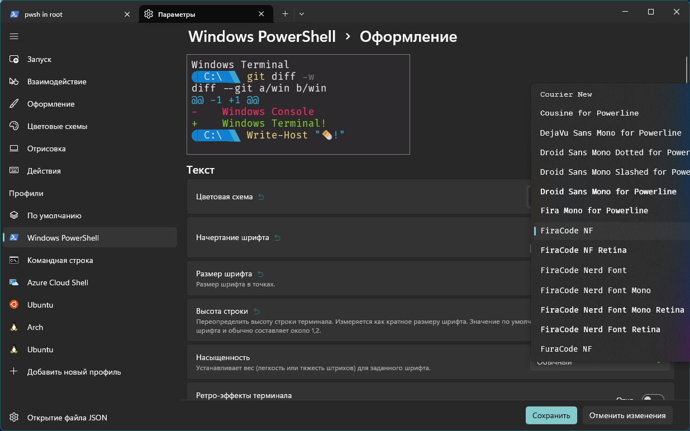
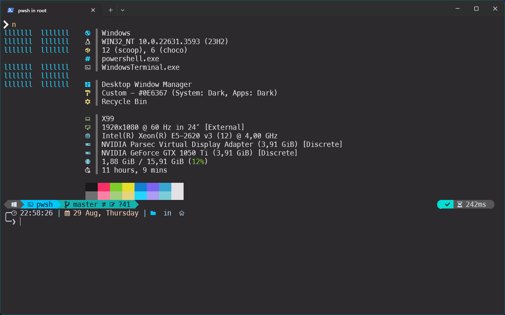
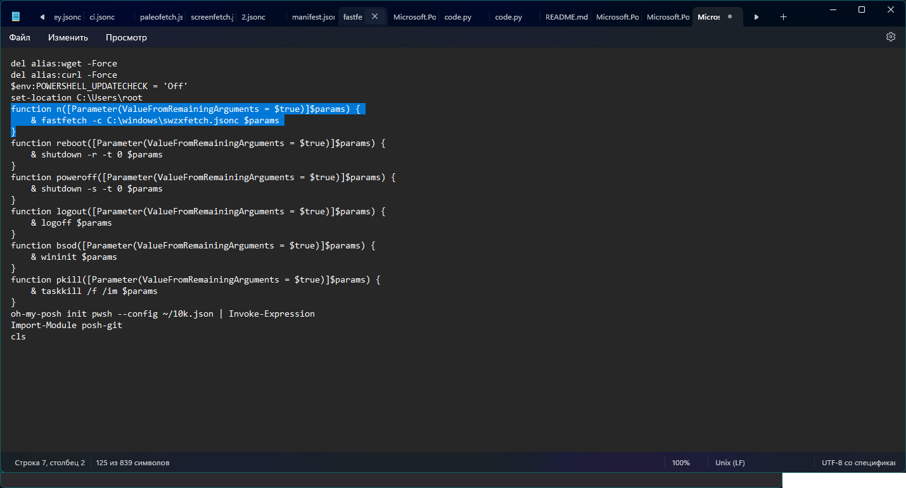

# Beginning
Данная инструкция поможет вам установить Fastfetch на Windows

# Установка
1. Установите [Scoop](https://scoop.sh/) на вашу ОС\
2. Введите команду `scoop install fastfetch`\
3. Запустите `fastfetch`\
4. Fastfetch установлен!

# Конфиг автора
5. Скачайте и установите шрифт FiraCode с репозитория\
6. Установите этот шрифт в терминале

7. Скачайте файл **swzxfetch.jsonc**, скопируйте в папку C:\Windows\
8. Запустите Fastfetch с командой `fastfetch -c C:\Windows\swzxfetch.jsonc`\
9. Profit!

# Алиасы для PowerShell
10. Впишите команду `notepad $profile`
11. Вставьте это - function n([Parameter(ValueFromRemainingArguments = $true)]$params) {\
& fastfetch -c C:\Windows\swzxfetch.jsonc $params в блокнот и сохраните!

